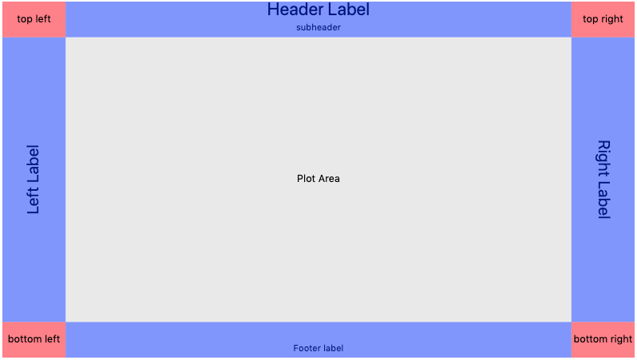

## D3 Abstraction Classes

Abstraction classes for D3 to support generating charts/maps quickly without getting into the minutia of laying out 
all the SVG elements.

Written for the freeCodeCamp Data Visualization projects, so I would quit writing essentially the same code repeatedly.
https://www.freecodecamp.org/learn/data-visualization/data-visualization-projects/

tooltips are provided by d3-tip.js
https://github.com/caged/d3-tip

License: MIT

Plans for the future:

After completing the freeCodeCamp Data Visualization projects, I felt that the abstractions were getting too high level 
for being able to customize easily. I've decided to take this down to just a chart/map layout abstraction which sets up 
areas within the SVG (defined as SVG groups) where you can use d3 to then add the desired content. This is an example 
of the default chart layout: 

This change means, I will be removing the classes D3BarChart and D3Scatterplot. I will then merge the functionality that
exists in D3Object and D3Chart and renaming the one class D3ChartLayout. Additionally, I will be working on changing the 
render functions to fully support the d3 general update pattern.
